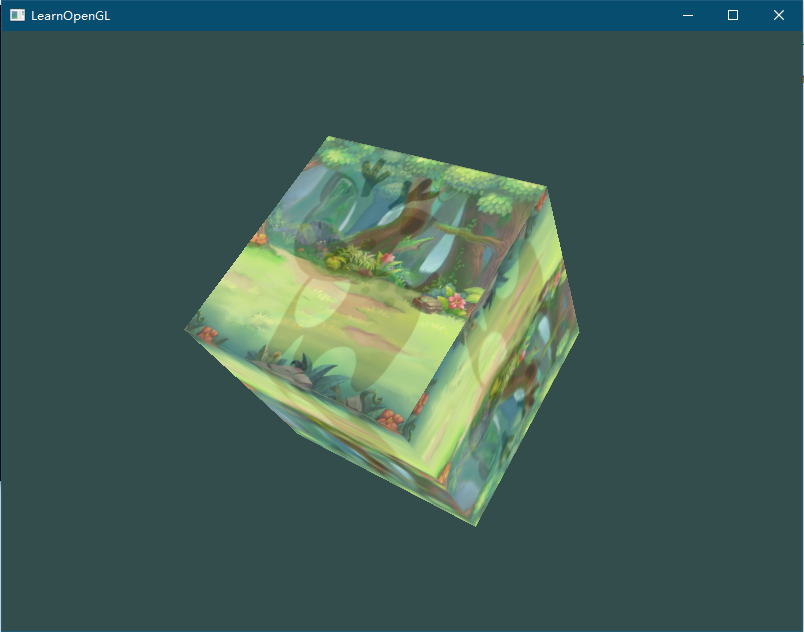

main.cpp
```cpp

#define STB_IMAGE_IMPLEMENTATION
#include "stb_image.h"

#include <iostream>

#define GLEW_STATIC
#include <GL/glew.h>
#include <GLFW/glfw3.h>
#include "Shader.h"

#include <glm/glm.hpp>
#include <glm/gtc/matrix_transform.hpp>
#include <glm/gtc/type_ptr.hpp>

float screenWidth = 800.0f;
float screenHeight = 600.0f;

void processInput(GLFWwindow* window) {
	if (glfwGetKey(window, GLFW_KEY_ESCAPE) == GLFW_PRESS)
		glfwSetWindowShouldClose(window, true);
}

int main() {
	glfwInit();
	glfwWindowHint(GLFW_CONTEXT_VERSION_MAJOR, 3);
	glfwWindowHint(GLFW_CONTEXT_VERSION_MINOR, 3);
	glfwWindowHint(GLFW_OPENGL_PROFILE, GLFW_OPENGL_CORE_PROFILE);
	//glfwWindowHint(GLFW_OPENGL_FORWARD_COMPAT, GL_TRUE);

	GLFWwindow* window = glfwCreateWindow(screenWidth, screenHeight, "LearnOpenGL", NULL, NULL);
	if (window == NULL)
	{
		std::cout << "Failed to create GLFW window" << std::endl;
		glfwTerminate();
		return -1;
	}
	glfwMakeContextCurrent(window);
	glViewport(0, 0, 800, 600);

	// init glew
	if (glewInit() != GLEW_OK) {
		std::cout << "Failed to init GLEW" << std::endl;
		glfwTerminate();
		return -1;
	}

	// 启用深度测试
	glEnable(GL_DEPTH_TEST);

	// 初始化着色器
	Shader* shader = new Shader("vertexSource.txt", "fragmentSource.txt");

	// set up vertex data (and buffer(s)) and configure vertex attributes
	float vertices[] = {
	-0.5f, -0.5f, -0.5f,  0.0f, 0.0f,
	 0.5f, -0.5f, -0.5f,  1.0f, 0.0f,
	 0.5f,  0.5f, -0.5f,  1.0f, 1.0f,
	 0.5f,  0.5f, -0.5f,  1.0f, 1.0f,
	-0.5f,  0.5f, -0.5f,  0.0f, 1.0f,
	-0.5f, -0.5f, -0.5f,  0.0f, 0.0f,

	-0.5f, -0.5f,  0.5f,  0.0f, 0.0f,
	 0.5f, -0.5f,  0.5f,  1.0f, 0.0f,
	 0.5f,  0.5f,  0.5f,  1.0f, 1.0f,
	 0.5f,  0.5f,  0.5f,  1.0f, 1.0f,
	-0.5f,  0.5f,  0.5f,  0.0f, 1.0f,
	-0.5f, -0.5f,  0.5f,  0.0f, 0.0f,

	-0.5f,  0.5f,  0.5f,  1.0f, 0.0f,
	-0.5f,  0.5f, -0.5f,  1.0f, 1.0f,
	-0.5f, -0.5f, -0.5f,  0.0f, 1.0f,
	-0.5f, -0.5f, -0.5f,  0.0f, 1.0f,
	-0.5f, -0.5f,  0.5f,  0.0f, 0.0f,
	-0.5f,  0.5f,  0.5f,  1.0f, 0.0f,

	 0.5f,  0.5f,  0.5f,  1.0f, 0.0f,
	 0.5f,  0.5f, -0.5f,  1.0f, 1.0f,
	 0.5f, -0.5f, -0.5f,  0.0f, 1.0f,
	 0.5f, -0.5f, -0.5f,  0.0f, 1.0f,
	 0.5f, -0.5f,  0.5f,  0.0f, 0.0f,
	 0.5f,  0.5f,  0.5f,  1.0f, 0.0f,

	-0.5f, -0.5f, -0.5f,  0.0f, 1.0f,
	 0.5f, -0.5f, -0.5f,  1.0f, 1.0f,
	 0.5f, -0.5f,  0.5f,  1.0f, 0.0f,
	 0.5f, -0.5f,  0.5f,  1.0f, 0.0f,
	-0.5f, -0.5f,  0.5f,  0.0f, 0.0f,
	-0.5f, -0.5f, -0.5f,  0.0f, 1.0f,

	-0.5f,  0.5f, -0.5f,  0.0f, 1.0f,
	 0.5f,  0.5f, -0.5f,  1.0f, 1.0f,
	 0.5f,  0.5f,  0.5f,  1.0f, 0.0f,
	 0.5f,  0.5f,  0.5f,  1.0f, 0.0f,
	-0.5f,  0.5f,  0.5f,  0.0f, 0.0f,
	-0.5f,  0.5f, -0.5f,  0.0f, 1.0f
	};
	unsigned int indices[] = {
		0, 1, 3, // first triangle
		1, 2, 3  // second triangle
	};

	unsigned int VAO, VBO, EBO;
	glGenVertexArrays(1, &VAO);
	glGenBuffers(1, &VBO);
	glGenBuffers(1, &EBO);

	glBindVertexArray(VAO);

	glBindBuffer(GL_ARRAY_BUFFER, VBO);
	glBufferData(GL_ARRAY_BUFFER, sizeof(vertices), vertices, GL_STATIC_DRAW);

	glBindBuffer(GL_ELEMENT_ARRAY_BUFFER, EBO);
	glBufferData(GL_ELEMENT_ARRAY_BUFFER, sizeof(indices), indices, GL_STATIC_DRAW);

	// position attribute
	glVertexAttribPointer(0, 3, GL_FLOAT, GL_FALSE, 5 * sizeof(float), (void*)0);
	glEnableVertexAttribArray(0);
	// color attribute
	//glVertexAttribPointer(1, 3, GL_FLOAT, GL_FALSE, 8 * sizeof(float), (void*)(3 * sizeof(float)));
	//glEnableVertexAttribArray(1);
	// texture coord attribute
	glVertexAttribPointer(2, 2, GL_FLOAT, GL_FALSE, 5 * sizeof(float), (void*)(3 * sizeof(float)));
	glEnableVertexAttribArray(2);

	// load and create a texture
	// -------------------------
	unsigned int texture1, texture2;
	glGenTextures(1, &texture1);
	glBindTexture(GL_TEXTURE_2D, texture1); // all upcoming GL_TEXTURE_2D operations now have effect on this texture object
	// set the texture wrapping parameters
	glTexParameteri(GL_TEXTURE_2D, GL_TEXTURE_WRAP_S, GL_REPEAT);	// set texture wrapping to GL_REPEAT (default wrapping method)
	glTexParameteri(GL_TEXTURE_2D, GL_TEXTURE_WRAP_T, GL_REPEAT);
	// set texture filtering parameters
	glTexParameteri(GL_TEXTURE_2D, GL_TEXTURE_MIN_FILTER, GL_LINEAR_MIPMAP_LINEAR);
	glTexParameteri(GL_TEXTURE_2D, GL_TEXTURE_MAG_FILTER, GL_LINEAR);
	// load image, create texture and generate mipmaps
	int width, height, nrChannels;
	stbi_set_flip_vertically_on_load(true);
	unsigned char* data = stbi_load("20220802165929.png", &width, &height, &nrChannels, 0);
	if (data)
	{
		glTexImage2D(GL_TEXTURE_2D, 0, GL_RGBA, width, height, 0, GL_RGBA, GL_UNSIGNED_BYTE, data);
		glGenerateMipmap(GL_TEXTURE_2D);
	}
	else
	{
		std::cout << "Failed to load texture" << std::endl;
	}
	stbi_image_free(data);

	glGenTextures(1, &texture2);
	glBindTexture(GL_TEXTURE_2D, texture2); // all upcoming GL_TEXTURE_2D operations now have effect on this texture object
	// set the texture wrapping parameters
	glTexParameteri(GL_TEXTURE_2D, GL_TEXTURE_WRAP_S, GL_REPEAT);	// set texture wrapping to GL_REPEAT (default wrapping method)
	glTexParameteri(GL_TEXTURE_2D, GL_TEXTURE_WRAP_T, GL_REPEAT);
	// set texture filtering parameters
	glTexParameteri(GL_TEXTURE_2D, GL_TEXTURE_MIN_FILTER, GL_LINEAR_MIPMAP_LINEAR);
	glTexParameteri(GL_TEXTURE_2D, GL_TEXTURE_MAG_FILTER, GL_LINEAR);
	// load image, create texture and generate mipmaps
	data = stbi_load("20220802165930.jpeg", &width, &height, &nrChannels, 0);
	if (data)
	{
		glTexImage2D(GL_TEXTURE_2D, 0, GL_RGB, width, height, 0, GL_RGB, GL_UNSIGNED_BYTE, data);
		glGenerateMipmap(GL_TEXTURE_2D);
	}
	else
	{
		std::cout << "Failed to load texture" << std::endl;
	}
	stbi_image_free(data);

	shader->use();
	glUniform1i(glGetUniformLocation(shader->ID, "texture1"), 0);
	glUniform1i(glGetUniformLocation(shader->ID, "texture2"), 1);

	glm::mat4 model;
	model = glm::rotate(model, glm::radians(-45.0f), glm::vec3(1.0f, 1.0f, 1.0f));

	glm::mat4 view;
	// 注意，我们将矩阵向我们要进行移动场景的反方向移动。
	view = glm::translate(view, glm::vec3(0.0f, 0.0f, -3.0f));

	glm::mat4 projection;
	projection = glm::perspective(glm::radians(45.0f), screenWidth / screenHeight, 0.1f, 100.0f);

	glUniformMatrix4fv(glGetUniformLocation(shader->ID, "model"), 1, GL_FALSE, glm::value_ptr(model));
	glUniformMatrix4fv(glGetUniformLocation(shader->ID, "view"), 1, GL_FALSE, glm::value_ptr(view));
	glUniformMatrix4fv(glGetUniformLocation(shader->ID, "projection"), 1, GL_FALSE, glm::value_ptr(projection));

	// 渲染循环
	while (!glfwWindowShouldClose(window))
	{
		// 输入
		processInput(window);

		glClearColor(0.2f, 0.3f, 0.3f, 1.0f);
		glClear(GL_COLOR_BUFFER_BIT | GL_DEPTH_BUFFER_BIT);

		// bind Texture
		glActiveTexture(GL_TEXTURE0);
		glBindTexture(GL_TEXTURE_2D, texture1);
		glActiveTexture(GL_TEXTURE1);
		glBindTexture(GL_TEXTURE_2D, texture2);

		shader->use();
		// 渲染指令
		glBindVertexArray(VAO);
		//glBindBuffer(GL_ELEMENT_ARRAY_BUFFER, EBO);
		//glDrawElements(GL_TRIANGLES, 6, GL_UNSIGNED_INT, 0);
		glDrawArrays(GL_TRIANGLES, 0, 36);

		// 检查并调用事件，交换缓冲
		glfwSwapBuffers(window);
		glfwPollEvents();
	}

	glDeleteVertexArrays(1, &VAO);
	glDeleteBuffers(1, &VBO);
	glDeleteBuffers(1, &EBO);

	glfwTerminate();
	return 0;
}
```


