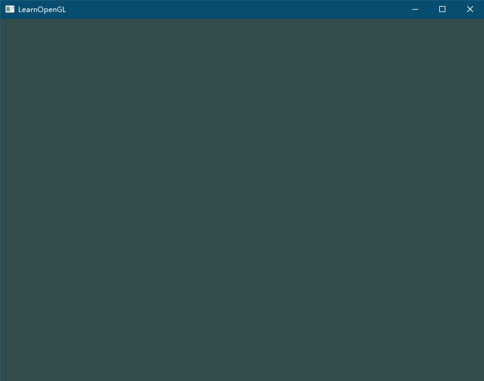

## 程序

```cpp
#define GLEW_STATIC

#include <iostream>
#include <GL/glew.h>
#include <GLFW/glfw3.h>

void processInput(GLFWwindow* window) {
	if (glfwGetKey(window, GLFW_KEY_ESCAPE) == GLFW_PRESS)
		glfwSetWindowShouldClose(window, true);
}

int main() {
	glfwInit();
	glfwWindowHint(GLFW_CONTEXT_VERSION_MAJOR, 3);
	glfwWindowHint(GLFW_CONTEXT_VERSION_MINOR, 3);
	glfwWindowHint(GLFW_OPENGL_PROFILE, GLFW_OPENGL_CORE_PROFILE);
	//glfwWindowHint(GLFW_OPENGL_FORWARD_COMPAT, GL_TRUE);

	GLFWwindow* window = glfwCreateWindow(800, 600, "LearnOpenGL", NULL, NULL);
	if (window == NULL)
	{
		std::cout << "Failed to create GLFW window" << std::endl;
		glfwTerminate();
		return -1;
	}
	glfwMakeContextCurrent(window);
	glViewport(0, 0, 800, 600);

	// 渲染循环
	while (!glfwWindowShouldClose(window))
	{
		glClearColor(0.2f, 0.3f, 0.3f, 1.0f);
		glClear(GL_COLOR_BUFFER_BIT);

		// 输入
		processInput(window);

		// 渲染指令


		// 检查并调用事件，交换缓冲
		glfwPollEvents();
		glfwSwapBuffers(window);
	}

	return 0;
}
```

## 测试


