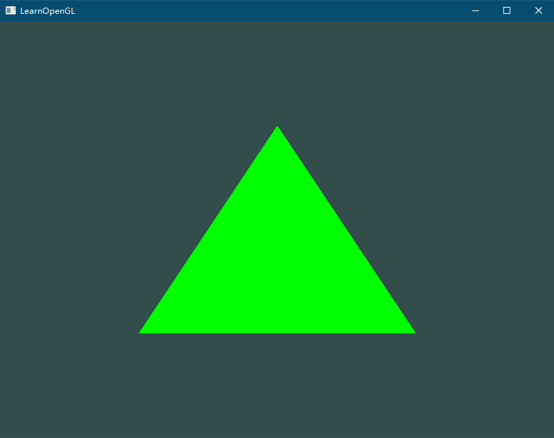
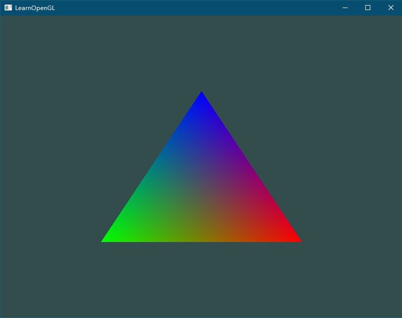

## 三角形换个色

```cpp
const char* fragmentShaderSource = "#version 330 core\n"
"out vec4 FragColor;\n"
"void main()\n"
"{\n"
"   FragColor = vec4(0.0f, 1.0f, 0.0f, 1.0f);\n"
"}\n\0";

// 修改为

const char* fragmentShaderSource = "#version 330 core\n"
"out vec4 FragColor;\n"
"void main()\n"
"{\n"
"   FragColor = vec4(0.0f, 1.0f, 0.0f, 1.0f);\n"  // vec4(r, g, b, a)
"}\n\0";

```



## 顶点颜色不同

顶点坐标增加3列，分别是r, g, b。

```cpp
#define GLEW_STATIC

#include <iostream>
#include <GL/glew.h>
#include <GLFW/glfw3.h>

float vertices[] = {
	// 位置              // 颜色
	 0.5f, -0.5f, 0.0f,  1.0f, 0.0f, 0.0f,   // 右下
	-0.5f, -0.5f, 0.0f,  0.0f, 1.0f, 0.0f,   // 左下
	 0.0f,  0.5f, 0.0f,  0.0f, 0.0f, 1.0f    // 顶部
};

unsigned int indices[] = {
	// 注意索引从0开始!
	// 此例的索引(0,1,2,3)就是顶点数组vertices的下标，
	// 这样可以由下标代表顶点组合成矩形

	//0, 1, 3, // 第一个三角形
	//1, 2, 3  // 第二个三角形

	2, 1, 0
};

const char* vertexShaderSource = "#version 330 core\n"
"layout (location = 0) in vec3 aPos;\n"
"layout (location = 1) in vec3 aColor;\n"
"out vec3 ourColor; \n"
"void main()\n"
"{\n"
"   gl_Position = vec4(aPos.x, aPos.y, aPos.z, 1.0);\n"
"   ourColor = aColor; \n"
"}\0";
const char* fragmentShaderSource = "#version 330 core\n"
"out vec4 FragColor;\n"
"in vec3 ourColor; \n"
"void main()\n"
"{\n"
"   FragColor = vec4(ourColor, 1.0f);\n"
"}\n\0";

void processInput(GLFWwindow* window) {
	if (glfwGetKey(window, GLFW_KEY_ESCAPE) == GLFW_PRESS)
		glfwSetWindowShouldClose(window, true);
}

int main() {
	glfwInit();
	glfwWindowHint(GLFW_CONTEXT_VERSION_MAJOR, 3);
	glfwWindowHint(GLFW_CONTEXT_VERSION_MINOR, 3);
	glfwWindowHint(GLFW_OPENGL_PROFILE, GLFW_OPENGL_CORE_PROFILE);
	//glfwWindowHint(GLFW_OPENGL_FORWARD_COMPAT, GL_TRUE);

	GLFWwindow* window = glfwCreateWindow(800, 600, "LearnOpenGL", NULL, NULL);
	if (window == NULL)
	{
		std::cout << "Failed to create GLFW window" << std::endl;
		glfwTerminate();
		return -1;
	}
	glfwMakeContextCurrent(window);
	glViewport(0, 0, 800, 600);

	// init glew
	if (glewInit() != GLEW_OK) {
		std::cout << "Failed to init GLEW" << std::endl;
		glfwTerminate();
		return -1;
	}

	unsigned int VAO, VBO, EBO;
	glGenVertexArrays(1, &VAO);
	glBindVertexArray(VAO);

	glGenBuffers(1, &VBO);
	glBindBuffer(GL_ARRAY_BUFFER, VBO);
	glBufferData(GL_ARRAY_BUFFER, sizeof(vertices), vertices, GL_STATIC_DRAW);

	glGenBuffers(1, &EBO);
	glBindBuffer(GL_ELEMENT_ARRAY_BUFFER, EBO);
	glBufferData(GL_ELEMENT_ARRAY_BUFFER, sizeof(indices), indices, GL_STATIC_DRAW);

	unsigned int vertexShader;
	vertexShader = glCreateShader(GL_VERTEX_SHADER);
	glShaderSource(vertexShader, 1, &vertexShaderSource, NULL);
	glCompileShader(vertexShader);

	unsigned int fragmentShader;
	fragmentShader = glCreateShader(GL_FRAGMENT_SHADER);
	glShaderSource(fragmentShader, 1, &fragmentShaderSource, NULL);
	glCompileShader(fragmentShader);

	unsigned int shaderProgram;
	shaderProgram = glCreateProgram();

	glAttachShader(shaderProgram, vertexShader);
	glAttachShader(shaderProgram, fragmentShader);
	glLinkProgram(shaderProgram);

	glDeleteShader(vertexShader);
	glDeleteShader(fragmentShader);

	// 位置属性
	glVertexAttribPointer(0, 3, GL_FLOAT, GL_FALSE, 6 * sizeof(float), (void*)0);
	glEnableVertexAttribArray(0);
	// 颜色属性
	glVertexAttribPointer(1, 3, GL_FLOAT, GL_FALSE, 6 * sizeof(float), (void*)(3 * sizeof(float)));
	glEnableVertexAttribArray(1);

	// 渲染循环
	while (!glfwWindowShouldClose(window))
	{
		glClearColor(0.2f, 0.3f, 0.3f, 1.0f);
		glClear(GL_COLOR_BUFFER_BIT);

		// 输入
		processInput(window);

		// 渲染指令
		glUseProgram(shaderProgram);
		glBindBuffer(GL_ELEMENT_ARRAY_BUFFER, EBO);
		glDrawElements(GL_TRIANGLES, 6, GL_UNSIGNED_INT, 0);

		// 检查并调用事件，交换缓冲
		glfwSwapBuffers(window);
		glfwPollEvents();
	}

	return 0;
}
```



## 画变化颜色的三角形

在FragmentShader中定义一个uniform的变量用于接收rgba的数值然后直接渲染。

> uniform是全局变量，我们可以在任何着色器中定义它们，而无需通过顶点着色器作为中介。顶点着色器中不需要这个uniform

```cpp
#define GLEW_STATIC

#include <iostream>
#include <GL/glew.h>
#include <GLFW/glfw3.h>

float vertices[] = {
	// 位置              // 颜色
	 0.5f, -0.5f, 0.0f,  1.0f, 0.0f, 0.0f,   // 右下
	-0.5f, -0.5f, 0.0f,  0.0f, 1.0f, 0.0f,   // 左下
	 0.0f,  0.5f, 0.0f,  0.0f, 0.0f, 1.0f    // 顶部
};

unsigned int indices[] = {
	// 注意索引从0开始!
	// 此例的索引(0,1,2,3)就是顶点数组vertices的下标，
	// 这样可以由下标代表顶点组合成矩形

	//0, 1, 3, // 第一个三角形
	//1, 2, 3  // 第二个三角形

	2, 1, 0
};

const char* vertexShaderSource = "#version 330 core\n"
"layout (location = 0) in vec3 aPos;\n"
"void main()\n"
"{\n"
"   gl_Position = vec4(aPos.x, aPos.y, aPos.z, 1.0);\n"
"}\0";
const char* fragmentShaderSource = "#version 330 core\n"
"out vec4 FragColor;\n"
"uniform vec4 ourColor; \n"
"void main()\n"
"{\n"
"   FragColor = ourColor;\n"
"}\n\0";

void processInput(GLFWwindow* window) {
	if (glfwGetKey(window, GLFW_KEY_ESCAPE) == GLFW_PRESS)
		glfwSetWindowShouldClose(window, true);
}

int main() {
	glfwInit();
	glfwWindowHint(GLFW_CONTEXT_VERSION_MAJOR, 3);
	glfwWindowHint(GLFW_CONTEXT_VERSION_MINOR, 3);
	glfwWindowHint(GLFW_OPENGL_PROFILE, GLFW_OPENGL_CORE_PROFILE);
	//glfwWindowHint(GLFW_OPENGL_FORWARD_COMPAT, GL_TRUE);

	GLFWwindow* window = glfwCreateWindow(800, 600, "LearnOpenGL", NULL, NULL);
	if (window == NULL)
	{
		std::cout << "Failed to create GLFW window" << std::endl;
		glfwTerminate();
		return -1;
	}
	glfwMakeContextCurrent(window);
	glViewport(0, 0, 800, 600);

	// init glew
	if (glewInit() != GLEW_OK) {
		std::cout << "Failed to init GLEW" << std::endl;
		glfwTerminate();
		return -1;
	}

	unsigned int VAO, VBO, EBO;
	glGenVertexArrays(1, &VAO);
	glBindVertexArray(VAO);

	glGenBuffers(1, &VBO);
	glBindBuffer(GL_ARRAY_BUFFER, VBO);
	glBufferData(GL_ARRAY_BUFFER, sizeof(vertices), vertices, GL_STATIC_DRAW);

	glGenBuffers(1, &EBO);
	glBindBuffer(GL_ELEMENT_ARRAY_BUFFER, EBO);
	glBufferData(GL_ELEMENT_ARRAY_BUFFER, sizeof(indices), indices, GL_STATIC_DRAW);

	unsigned int vertexShader;
	vertexShader = glCreateShader(GL_VERTEX_SHADER);
	glShaderSource(vertexShader, 1, &vertexShaderSource, NULL);
	glCompileShader(vertexShader);

	unsigned int fragmentShader;
	fragmentShader = glCreateShader(GL_FRAGMENT_SHADER);
	glShaderSource(fragmentShader, 1, &fragmentShaderSource, NULL);
	glCompileShader(fragmentShader);

	unsigned int shaderProgram;
	shaderProgram = glCreateProgram();

	glAttachShader(shaderProgram, vertexShader);
	glAttachShader(shaderProgram, fragmentShader);
	glLinkProgram(shaderProgram);

	glDeleteShader(vertexShader);
	glDeleteShader(fragmentShader);

	// 位置属性
	glVertexAttribPointer(0, 3, GL_FLOAT, GL_FALSE, 6 * sizeof(float), (void*)0);
	glEnableVertexAttribArray(0);
	// 颜色属性
	glVertexAttribPointer(1, 3, GL_FLOAT, GL_FALSE, 6 * sizeof(float), (void*)(3 * sizeof(float)));
	glEnableVertexAttribArray(1);

	// 渲染循环
	while (!glfwWindowShouldClose(window))
	{
		glClearColor(0.2f, 0.3f, 0.3f, 1.0f);
		glClear(GL_COLOR_BUFFER_BIT);

		// 输入
		processInput(window);

		// 渲染指令
		float timeValue = glfwGetTime();
		float greenValue = (sin(timeValue) / 2.0f) + 0.5f;
		int vertexColorLocation = glGetUniformLocation(shaderProgram, "ourColor");
		glUseProgram(shaderProgram);
		glUniform4f(vertexColorLocation, 0.0f, greenValue, 0.0f, 1.0f);
		glBindBuffer(GL_ELEMENT_ARRAY_BUFFER, EBO);
		glDrawElements(GL_TRIANGLES, 6, GL_UNSIGNED_INT, 0);

		// 检查并调用事件，交换缓冲
		glfwSwapBuffers(window);
		glfwPollEvents();
	}

	return 0;
}
```


