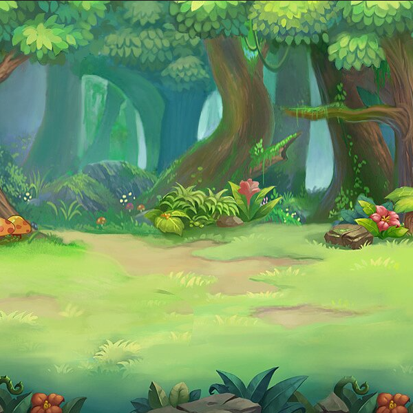
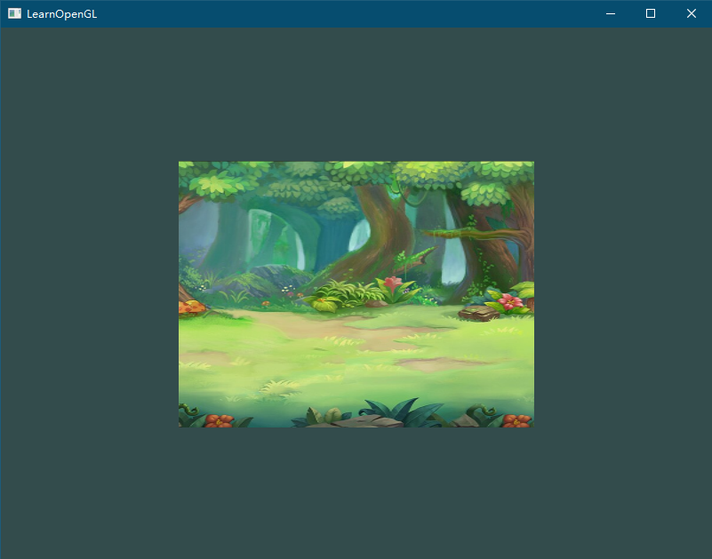

## 画贴图

准备一张**正方形**的贴图，注意必须要正方形的，否则会画变形



## 代码

vertexSource.txt
```
#version 330 core
layout (location = 0) in vec3 aPos;
layout (location = 1) in vec3 aColor;
layout (location = 2) in vec2 aTexCoord;

out vec3 ourColor;
out vec2 TexCoord;

void main()
{
    gl_Position = vec4(aPos, 1.0);
    ourColor = aColor;
    TexCoord = aTexCoord;
}
```

fragmentSource.txt
```
#version 330 core
out vec4 FragColor;

in vec3 ourColor;
in vec2 TexCoord;
uniform sampler2D ourTexture;

void main() {
	FragColor = texture(ourTexture, TexCoord);
}
```

main.cpp
```cpp
#define STB_IMAGE_IMPLEMENTATION
#include "stb_image.h"

#include <iostream>

#define GLEW_STATIC
#include <GL/glew.h>
#include <GLFW/glfw3.h>
#include "Shader.h"

void processInput(GLFWwindow* window) {
	if (glfwGetKey(window, GLFW_KEY_ESCAPE) == GLFW_PRESS)
		glfwSetWindowShouldClose(window, true);
}

int main() {
	glfwInit();
	glfwWindowHint(GLFW_CONTEXT_VERSION_MAJOR, 3);
	glfwWindowHint(GLFW_CONTEXT_VERSION_MINOR, 3);
	glfwWindowHint(GLFW_OPENGL_PROFILE, GLFW_OPENGL_CORE_PROFILE);
	//glfwWindowHint(GLFW_OPENGL_FORWARD_COMPAT, GL_TRUE);

	GLFWwindow* window = glfwCreateWindow(800, 600, "LearnOpenGL", NULL, NULL);
	if (window == NULL)
	{
		std::cout << "Failed to create GLFW window" << std::endl;
		glfwTerminate();
		return -1;
	}
	glfwMakeContextCurrent(window);
	glViewport(0, 0, 800, 600);

	// init glew
	if (glewInit() != GLEW_OK) {
		std::cout << "Failed to init GLEW" << std::endl;
		glfwTerminate();
		return -1;
	}

	// 初始化着色器
	Shader* shader = new Shader("vertexSource.txt", "fragmentSource.txt");

	// set up vertex data (and buffer(s)) and configure vertex attributes
	float vertices[] = {
		// positions          // colors           // texture coords
		 0.5f,  0.5f, 0.0f,   1.0f, 0.0f, 0.0f,   1.0f, 1.0f, // top right
		 0.5f, -0.5f, 0.0f,   0.0f, 1.0f, 0.0f,   1.0f, 0.0f, // bottom right
		-0.5f, -0.5f, 0.0f,   0.0f, 0.0f, 1.0f,   0.0f, 0.0f, // bottom left
		-0.5f,  0.5f, 0.0f,   1.0f, 1.0f, 0.0f,   0.0f, 1.0f  // top left
	};
	unsigned int indices[] = {
		0, 1, 3, // first triangle
		1, 2, 3  // second triangle
	};

	unsigned int VAO, VBO, EBO;
	glGenVertexArrays(1, &VAO);
	glBindVertexArray(VAO);

	glGenBuffers(1, &VBO);
	glBindBuffer(GL_ARRAY_BUFFER, VBO);
	glBufferData(GL_ARRAY_BUFFER, sizeof(vertices), vertices, GL_STATIC_DRAW);

	glGenBuffers(1, &EBO);
	glBindBuffer(GL_ELEMENT_ARRAY_BUFFER, EBO);
	glBufferData(GL_ELEMENT_ARRAY_BUFFER, sizeof(indices), indices, GL_STATIC_DRAW);

	// position attribute
	glVertexAttribPointer(0, 3, GL_FLOAT, GL_FALSE, 8 * sizeof(float), (void*)0);
	glEnableVertexAttribArray(0);
	// color attribute
	glVertexAttribPointer(1, 3, GL_FLOAT, GL_FALSE, 8 * sizeof(float), (void*)(3 * sizeof(float)));
	glEnableVertexAttribArray(1);
	// texture coord attribute
	glVertexAttribPointer(2, 2, GL_FLOAT, GL_FALSE, 8 * sizeof(float), (void*)(6 * sizeof(float)));
	glEnableVertexAttribArray(2);

	// load and create a texture
	// -------------------------
	unsigned int texture;
	glGenTextures(1, &texture);
	glBindTexture(GL_TEXTURE_2D, texture); // all upcoming GL_TEXTURE_2D operations now have effect on this texture object
	// set the texture wrapping parameters
	glTexParameteri(GL_TEXTURE_2D, GL_TEXTURE_WRAP_S, GL_REPEAT);	// set texture wrapping to GL_REPEAT (default wrapping method)
	glTexParameteri(GL_TEXTURE_2D, GL_TEXTURE_WRAP_T, GL_REPEAT);
	// set texture filtering parameters
	glTexParameteri(GL_TEXTURE_2D, GL_TEXTURE_MIN_FILTER, GL_LINEAR_MIPMAP_LINEAR);
	glTexParameteri(GL_TEXTURE_2D, GL_TEXTURE_MAG_FILTER, GL_LINEAR);
	// load image, create texture and generate mipmaps
	stbi_set_flip_vertically_on_load(true);
	int width, height, nrChannels;
	unsigned char* data = stbi_load("20220802165929.png", &width, &height, &nrChannels, 0);
	if (data)
	{
        // PNG图片是四通道的，所以下面用 GL_RGBA
		glTexImage2D(GL_TEXTURE_2D, 0, GL_RGBA, width, height, 0, GL_RGBA, GL_UNSIGNED_BYTE, data);
		glGenerateMipmap(GL_TEXTURE_2D);
	}
	else
	{
		std::cout << "Failed to load texture" << std::endl;
	}
	stbi_image_free(data);

	// 渲染循环
	while (!glfwWindowShouldClose(window))
	{
		// 输入
		processInput(window);

		glClearColor(0.2f, 0.3f, 0.3f, 1.0f);
		glClear(GL_COLOR_BUFFER_BIT);

		// bind Texture
		glBindTexture(GL_TEXTURE_2D, texture);

		// 渲染指令
		glBindVertexArray(VAO);
		glBindBuffer(GL_ELEMENT_ARRAY_BUFFER, EBO);

		shader->use();
		glDrawElements(GL_TRIANGLES, 6, GL_UNSIGNED_INT, 0);

		// 检查并调用事件，交换缓冲
		glfwSwapBuffers(window);
		glfwPollEvents();
	}

	glDeleteVertexArrays(1, &VAO);
	glDeleteBuffers(1, &VBO);
	glDeleteBuffers(1, &EBO);

	glfwTerminate();
	return 0;
}
```



## 画多张叠加贴图

画两张就要两个texture

main.cpp
```cpp

#define STB_IMAGE_IMPLEMENTATION
#include "stb_image.h"

#include <iostream>

#define GLEW_STATIC
#include <GL/glew.h>
#include <GLFW/glfw3.h>
#include "Shader.h"

void processInput(GLFWwindow* window) {
	if (glfwGetKey(window, GLFW_KEY_ESCAPE) == GLFW_PRESS)
		glfwSetWindowShouldClose(window, true);
}

int main() {
	glfwInit();
	glfwWindowHint(GLFW_CONTEXT_VERSION_MAJOR, 3);
	glfwWindowHint(GLFW_CONTEXT_VERSION_MINOR, 3);
	glfwWindowHint(GLFW_OPENGL_PROFILE, GLFW_OPENGL_CORE_PROFILE);
	//glfwWindowHint(GLFW_OPENGL_FORWARD_COMPAT, GL_TRUE);

	GLFWwindow* window = glfwCreateWindow(800, 600, "LearnOpenGL", NULL, NULL);
	if (window == NULL)
	{
		std::cout << "Failed to create GLFW window" << std::endl;
		glfwTerminate();
		return -1;
	}
	glfwMakeContextCurrent(window);
	glViewport(0, 0, 800, 600);

	// init glew
	if (glewInit() != GLEW_OK) {
		std::cout << "Failed to init GLEW" << std::endl;
		glfwTerminate();
		return -1;
	}

	// 初始化着色器
	Shader* shader = new Shader("vertexSource.txt", "fragmentSource.txt");

	// set up vertex data (and buffer(s)) and configure vertex attributes
	float vertices[] = {
		// positions          // colors           // texture coords
		 0.5f,  0.5f, 0.0f,   1.0f, 0.0f, 0.0f,   1.0f, 1.0f, // top right
		 0.5f, -0.5f, 0.0f,   0.0f, 1.0f, 0.0f,   1.0f, 0.0f, // bottom right
		-0.5f, -0.5f, 0.0f,   0.0f, 0.0f, 1.0f,   0.0f, 0.0f, // bottom left
		-0.5f,  0.5f, 0.0f,   1.0f, 1.0f, 0.0f,   0.0f, 1.0f  // top left
	};
	unsigned int indices[] = {
		0, 1, 3, // first triangle
		1, 2, 3  // second triangle
	};

	unsigned int VAO, VBO, EBO;
	glGenVertexArrays(1, &VAO);
	glGenBuffers(1, &VBO);
	glGenBuffers(1, &EBO);

	glBindVertexArray(VAO);

	glBindBuffer(GL_ARRAY_BUFFER, VBO);
	glBufferData(GL_ARRAY_BUFFER, sizeof(vertices), vertices, GL_STATIC_DRAW);

	glBindBuffer(GL_ELEMENT_ARRAY_BUFFER, EBO);
	glBufferData(GL_ELEMENT_ARRAY_BUFFER, sizeof(indices), indices, GL_STATIC_DRAW);

	// position attribute
	glVertexAttribPointer(0, 3, GL_FLOAT, GL_FALSE, 8 * sizeof(float), (void*)0);
	glEnableVertexAttribArray(0);
	// color attribute
	glVertexAttribPointer(1, 3, GL_FLOAT, GL_FALSE, 8 * sizeof(float), (void*)(3 * sizeof(float)));
	glEnableVertexAttribArray(1);
	// texture coord attribute
	glVertexAttribPointer(2, 2, GL_FLOAT, GL_FALSE, 8 * sizeof(float), (void*)(6 * sizeof(float)));
	glEnableVertexAttribArray(2);

	// load and create a texture
	// -------------------------
	unsigned int texture1, texture2;
	glGenTextures(1, &texture1);
	glBindTexture(GL_TEXTURE_2D, texture1); // all upcoming GL_TEXTURE_2D operations now have effect on this texture object
	// set the texture wrapping parameters
	glTexParameteri(GL_TEXTURE_2D, GL_TEXTURE_WRAP_S, GL_REPEAT);	// set texture wrapping to GL_REPEAT (default wrapping method)
	glTexParameteri(GL_TEXTURE_2D, GL_TEXTURE_WRAP_T, GL_REPEAT);
	// set texture filtering parameters
	glTexParameteri(GL_TEXTURE_2D, GL_TEXTURE_MIN_FILTER, GL_LINEAR_MIPMAP_LINEAR);
	glTexParameteri(GL_TEXTURE_2D, GL_TEXTURE_MAG_FILTER, GL_LINEAR);
	// load image, create texture and generate mipmaps
	int width, height, nrChannels;
	stbi_set_flip_vertically_on_load(true);
	unsigned char* data = stbi_load("20220802165929.png", &width, &height, &nrChannels, 0);
	if (data)
	{
		glTexImage2D(GL_TEXTURE_2D, 0, GL_RGBA, width, height, 0, GL_RGBA, GL_UNSIGNED_BYTE, data);
		glGenerateMipmap(GL_TEXTURE_2D);
	}
	else
	{
		std::cout << "Failed to load texture" << std::endl;
	}
	stbi_image_free(data);

	glGenTextures(1, &texture2);
	glBindTexture(GL_TEXTURE_2D, texture2); // all upcoming GL_TEXTURE_2D operations now have effect on this texture object
	// set the texture wrapping parameters
	glTexParameteri(GL_TEXTURE_2D, GL_TEXTURE_WRAP_S, GL_REPEAT);	// set texture wrapping to GL_REPEAT (default wrapping method)
	glTexParameteri(GL_TEXTURE_2D, GL_TEXTURE_WRAP_T, GL_REPEAT);
	// set texture filtering parameters
	glTexParameteri(GL_TEXTURE_2D, GL_TEXTURE_MIN_FILTER, GL_LINEAR_MIPMAP_LINEAR);
	glTexParameteri(GL_TEXTURE_2D, GL_TEXTURE_MAG_FILTER, GL_LINEAR);
	// load image, create texture and generate mipmaps
	data = stbi_load("20220802165930.jpeg", &width, &height, &nrChannels, 0);
	if (data)
	{
		glTexImage2D(GL_TEXTURE_2D, 0, GL_RGB, width, height, 0, GL_RGB, GL_UNSIGNED_BYTE, data);
		glGenerateMipmap(GL_TEXTURE_2D);
	}
	else
	{
		std::cout << "Failed to load texture" << std::endl;
	}
	stbi_image_free(data);

	shader->use();
	glUniform1i(glGetUniformLocation(shader->ID, "texture1"), 0);
	glUniform1i(glGetUniformLocation(shader->ID, "texture2"), 1);

	// 渲染循环
	while (!glfwWindowShouldClose(window))
	{
		// 输入
		processInput(window);

		glClearColor(0.2f, 0.3f, 0.3f, 1.0f);
		glClear(GL_COLOR_BUFFER_BIT);

		// bind Texture
		glActiveTexture(GL_TEXTURE0);
		glBindTexture(GL_TEXTURE_2D, texture1);
		glActiveTexture(GL_TEXTURE1);
		glBindTexture(GL_TEXTURE_2D, texture2);

		shader->use();
		// 渲染指令
		glBindVertexArray(VAO);
		//glBindBuffer(GL_ELEMENT_ARRAY_BUFFER, EBO);
		glDrawElements(GL_TRIANGLES, 6, GL_UNSIGNED_INT, 0);

		// 检查并调用事件，交换缓冲
		glfwSwapBuffers(window);
		glfwPollEvents();
	}

	glDeleteVertexArrays(1, &VAO);
	glDeleteBuffers(1, &VBO);
	glDeleteBuffers(1, &EBO);

	glfwTerminate();
	return 0;
}
```

改造shader

vertexSource.txt
```
#version 330 core
layout (location = 0) in vec3 aPos;
layout (location = 1) in vec3 aColor;
layout (location = 2) in vec2 aTexCoord;

out vec3 ourColor;
out vec2 TexCoord;

void main()
{
	gl_Position = vec4(aPos, 1.0);
	ourColor = aColor;
	TexCoord = vec2(aTexCoord.x, aTexCoord.y);
}
```

fragmentSource.txt
```
#version 330 core
out vec4 FragColor;

in vec3 ourColor;
in vec2 TexCoord;

// texture samplers
uniform sampler2D texture1;
uniform sampler2D texture2;

void main()
{
	// linearly interpolate between both textures (80% container, 20% awesomeface)
	FragColor = mix(texture(texture1, TexCoord), texture(texture2, TexCoord), 0.2);
}
```


