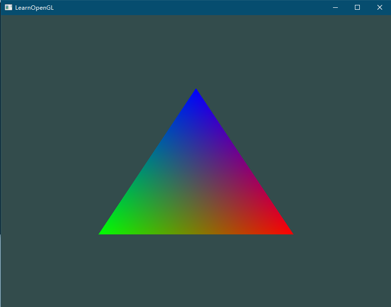

> 将shader当成字符串拼接在程序里用是非常不方便的，定义一个读取着色器文件并编译后直接输出给程序使用的工具类

## 程序

Shader.h
```cpp
#pragma once
#include <string>

class Shader
{
public:
	Shader(const char* vertexPath, const char* fragmentPath);
	void use();

	std::string vertexString;
	std::string fragmentString;
	const char* vertexSource;
	const char* fragmentSource;

	unsigned int ID; //Shader Program ID

private:
	void checkCompileErrors(unsigned int ID, std::string type);
};
```

Shader.cpp

```cpp
#include "Shader.h"
#include <fstream>
#include <sstream>
#include <iostream>
#include <GL/glew.h>

Shader::Shader(const char* vertexPath, const char* fragmentPath) {
	std::ifstream vertexFile;
	std::ifstream fragmentFile;
	std::stringstream vertexSStream;
	std::stringstream fragmentSStream;

	vertexFile.open(vertexPath);
	fragmentFile.open(fragmentPath);
	vertexFile.exceptions(std::ifstream::failbit || std::ifstream::badbit);
	fragmentFile.exceptions(std::ifstream::failbit || std::ifstream::badbit);

	try
	{
		if (!vertexFile.is_open() || !fragmentFile.is_open()) {
			throw std::exception("open file error");
		}
		vertexSStream << vertexFile.rdbuf();
		fragmentSStream << fragmentFile.rdbuf();

		vertexString = vertexSStream.str();
		fragmentString = fragmentSStream.str();

		vertexSource = vertexString.c_str();
		fragmentSource = fragmentString.c_str();

		//printf(vertexSource);
		//printf(fragmentSource);

		unsigned int vertex, fragment;
		vertex = glCreateShader(GL_VERTEX_SHADER);
		glShaderSource(vertex, 1, &vertexSource, NULL);
		glCompileShader(vertex);
		checkCompileErrors(vertex, "VERTEX");

		fragment = glCreateShader(GL_FRAGMENT_SHADER);
		glShaderSource(fragment, 1, &fragmentSource, NULL);
		glCompileShader(fragment);
		checkCompileErrors(fragment, "FRAGMENT");

		ID = glCreateProgram();
		glAttachShader(ID, vertex);
		glAttachShader(ID, fragment);
		glLinkProgram(ID);
		checkCompileErrors(ID, "PROGRAM");

		glDeleteShader(vertex);
		glDeleteShader(fragment);
	}
	catch (const std::exception& ex)
	{
		//std::cout << ex.what() << std::endl;
		printf(ex.what());
	}
}

void Shader::use() {
	glUseProgram(ID);
}

void Shader::checkCompileErrors(unsigned int ID, std::string type) {
	int success;
	char infoLog[512];

	if (type != "PROGRAM") {
		glGetShaderiv(ID, GL_COMPILE_STATUS, &success);
		if (!success) {
			glGetShaderInfoLog(ID, 512, NULL, infoLog);
			std::cout << "shader compile error: " << infoLog << std::endl;
		}
	}
	else {
		glGetProgramiv(ID, GL_LINK_STATUS, &success);
		if (!success) {
			glGetProgramInfoLog(ID, 512, NULL, infoLog);
			std::cout << "program compile error: " << infoLog << std::endl;
		}
	}

}
```

## 顶点着色器

创建文件 `vertexSource.txt`

```txt
#version 330 core

layout (location = 0) in vec3 aPos;
layout (location = 1) in vec3 aColor;
out vec4 vertexColor; // 为片段着色器指定一个颜色输出

void main() {
   gl_Position = vec4(aPos.x, aPos.y, aPos.z, 1.0);
   vertexColor = vec4(aColor.x, aColor.y, aColor.z, 1.0);
}
```

## 片段着色器

创建文件 `fragmentSource.txt`

```txt
#version 330 core

out vec4 FragColor;
in vec4 vertexColor;
//uniform vec4 ourColor;

void main() {
	FragColor = vertexColor;
}
```

## 使用

```cpp
#define GLEW_STATIC

#include <iostream>
#include <GL/glew.h>
#include <GLFW/glfw3.h>
#include "Shader.h"

float vertices[] = {
	// 位置              // 颜色
	 0.5f, -0.5f, 0.0f,  1.0f, 0.0f, 0.0f,   // 右下
	-0.5f, -0.5f, 0.0f,  0.0f, 1.0f, 0.0f,   // 左下
	 0.0f,  0.5f, 0.0f,  0.0f, 0.0f, 1.0f    // 顶部
};

unsigned int indices[] = {
	// 注意索引从0开始!
	// 此例的索引(0,1,2,3)就是顶点数组vertices的下标，
	// 这样可以由下标代表顶点组合成矩形

	//0, 1, 3, // 第一个三角形
	//1, 2, 3  // 第二个三角形

	2, 1, 0
};

void processInput(GLFWwindow* window) {
	if (glfwGetKey(window, GLFW_KEY_ESCAPE) == GLFW_PRESS)
		glfwSetWindowShouldClose(window, true);
}

int main() {
	glfwInit();
	glfwWindowHint(GLFW_CONTEXT_VERSION_MAJOR, 3);
	glfwWindowHint(GLFW_CONTEXT_VERSION_MINOR, 3);
	glfwWindowHint(GLFW_OPENGL_PROFILE, GLFW_OPENGL_CORE_PROFILE);
	//glfwWindowHint(GLFW_OPENGL_FORWARD_COMPAT, GL_TRUE);

	GLFWwindow* window = glfwCreateWindow(800, 600, "LearnOpenGL", NULL, NULL);
	if (window == NULL)
	{
		std::cout << "Failed to create GLFW window" << std::endl;
		glfwTerminate();
		return -1;
	}
	glfwMakeContextCurrent(window);
	glViewport(0, 0, 800, 600);

	// init glew
	if (glewInit() != GLEW_OK) {
		std::cout << "Failed to init GLEW" << std::endl;
		glfwTerminate();
		return -1;
	}

	// 初始化着色器
	Shader* shader = new Shader("vertexSource.txt", "fragmentSource.txt");

	unsigned int VAO, VBO, EBO;
	glGenVertexArrays(1, &VAO);
	glBindVertexArray(VAO);

	glGenBuffers(1, &VBO);
	glBindBuffer(GL_ARRAY_BUFFER, VBO);
	glBufferData(GL_ARRAY_BUFFER, sizeof(vertices), vertices, GL_STATIC_DRAW);

	glGenBuffers(1, &EBO);
	glBindBuffer(GL_ELEMENT_ARRAY_BUFFER, EBO);
	glBufferData(GL_ELEMENT_ARRAY_BUFFER, sizeof(indices), indices, GL_STATIC_DRAW);

	// 位置属性
	glVertexAttribPointer(0, 3, GL_FLOAT, GL_FALSE, 6 * sizeof(float), (void*)0);
	glEnableVertexAttribArray(0);
	// 颜色属性
	glVertexAttribPointer(1, 3, GL_FLOAT, GL_FALSE, 6 * sizeof(float), (void*)(3 * sizeof(float)));
	glEnableVertexAttribArray(1);

	// 渲染循环
	while (!glfwWindowShouldClose(window))
	{
		glClearColor(0.2f, 0.3f, 0.3f, 1.0f);
		glClear(GL_COLOR_BUFFER_BIT);

		// 输入
		processInput(window);

		// 渲染指令
		shader->use();
		glBindBuffer(GL_ELEMENT_ARRAY_BUFFER, EBO);
		glDrawElements(GL_TRIANGLES, 6, GL_UNSIGNED_INT, 0);

		// 检查并调用事件，交换缓冲
		glfwSwapBuffers(window);
		glfwPollEvents();
	}

	return 0;
}
```




